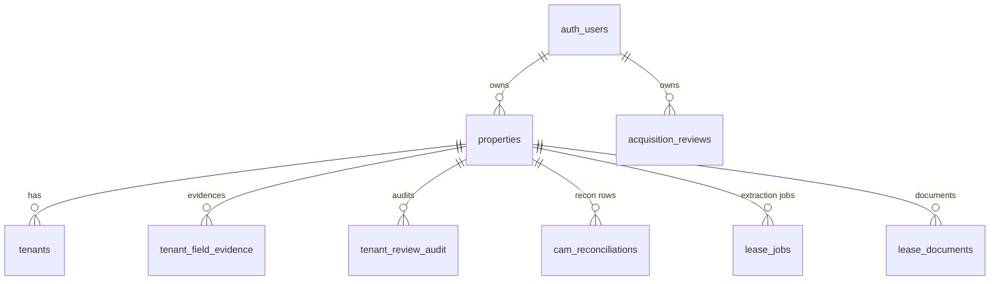

# MainStreet — Database & Persistence Reference

Every persisted object: where it lives, its fields, its relationships, its
lifecycle, and how it survives a round-trip. Supabase (Postgres + RLS +
Storage) is the source of truth; localStorage is an offline mirror only.

---

## 1. The storage model — hybrid blob + normalized

MainStreet deliberately uses **one JSONB blob per property**
(`properties.data`) as the primary store, with **normalized tables** added only
where a real need exists (cross-property queries, audit immutability, async
jobs). This keeps the schema stable while the product iterates fast, at the
cost of a strict discipline documented in §4.



All tables carry **RLS policies** scoping rows to `user_id` (hardened in
migrations 005/008). Tenant-role users get read-only access via the app layer
(`savePropertyData` returns early for tenants) plus passive isolation
(no `activePropId` in tenant mode).

## 2. Tables

### properties
The anchor table. `id (uuid)`, `user_id → auth.users`, `name`, `sqft`, and
**`data` (jsonb)** — the whitelisted property blob (§3). Everything else
references it with `on delete cascade`.

### tenants
Normalized tenant list (id, property_id, name, sqft, base fields) used for the
light portfolio load. **The blob's `data.tenants` is authoritative for rich
fields** (review state, overrides, capBaseAmount, confidence) — the table
exists so the property list renders without pulling blobs. Migration 009 makes
tenant resync atomic.

### tenant_field_evidence
Normalized evidence snapshots: `property_id`, `tenant_id`, `field_key`,
`value`, `confidence_status (verified|estimated|missing)`, `confidence_note`,
`source_file`, `source_page`, `extraction_id/version`, reviewer fields
(`reviewer_uid/email`, `reviewed_at`, `approved`, `manually_edited`,
`original_extracted_value`). When `ms_useNormalizedEvidence` is on, this table
is authoritative and `fieldEvidence` is omitted from the blob to avoid double
storage.

### tenant_review_audit
Append-only review audit trail: `action`, `label`, `severity
(info|success|warning|error)`, `old_value/new_value`,
`review_state_before/after`, reviewer identity, `client_ts`. Written by
`audit-service.js`; never updated or deleted.

### cam_reconciliations
One row **per tenant per reconciliation run**: `year`, `actual_cam`,
`expected_cam`, `variance`, `allocated_amount`, `pro_rata_percent`,
`total_expenses`, `reconciled_at`. Enables future cross-property/YoY queries;
the blob's `camReconciliation` snapshot remains what the UI renders from.

### lease_jobs
Async extraction job tracking: `status`, `stage`, `progress`, `file_name/size`,
`confidence_level (high|medium|low|failed)`, `confidence_score (0–100)`,
`extraction_route (text|pdf-direct|unknown)`, `error_message`,
`processing_started/completed_at`, `retry_count`, `debug_summary (jsonb)`.

### lease_documents
Uploaded document metadata linking properties/tenants to **Supabase Storage**
objects (the `fileUrl`s the Evidence Viewer fetches).

### acquisition_reviews
Owned by `user_id` directly (not property-scoped — reviews concern properties
you *don't own yet*): `name`, `status ('draft'…)`, `data (jsonb)` holding the
uploaded rent roll analysis, findings, and decision-report inputs. Migration
007 fixed the status check constraint.

## 3. The property blob — `properties.data`

`saveProperty` writes an **explicit whitelist** (script.js `saveProperty`).
Anything not on this list does not survive a save:

| Key | Object | Notes |
|---|---|---|
| `tenants[]` | Tenant records incl. review state, `fieldEvidence` snapshots (unless normalized reads are on), caps, overrides | Rich source of truth |
| `invoices[]` | Uploaded/imported invoices (categorized, dedup-flagged) | Blob URLs stripped first |
| `disputes[]` | Dispute records + resolution + audit fingerprint | |
| `camYear` | Active reconciliation year | |
| `results` | Legacy recon shape (kept for back-compat) | Guarded: only overwritten when a run happened this session |
| `camReconciliation` | Recon snapshot: `{propId, results[], total, invoices, camRuns[]}` | `invoicesFull` stripped before save (in-session only); `propId` verified on load |
| `settlement` | RLUSD settlement record: `{status, txHash, amount, from, to, timestamp, explorerLink, fingerprint}` | **Must** be on the whitelist — omitting it was the "stuck pending" bug |
| `aiDrafts[]` | Saved Drafting Studio documents | |
| `escrowReserves[]` | Reserve definitions + `evidence{field}` quotes | Blob pattern, per Phase 21 |
| `drawRequests[]` | Draw lifecycle records (`draft→submitted→…→funded`) | |
| `activityLog[]` / `timeline[]` | Activity + event history | |
| `_demoVersion` / `_demoV` | Demo re-seed markers | Preserved so saves don't force re-seeding |

**Workspace Context, AI answer history (`_aiwHistory`), and Evidence Viewer
state are deliberately NOT persisted** — session-scoped by design.

## 4. Lifecycle — the four-hop persistence invariant

Every blob field must be carried through **all four hops** or it silently
disappears:

```
1. saveProperty      — field must be on the data{} WHITELIST
2. loadPropertyData  — field must be in the blob→property FIELD MAP
3. merge             — DB-authoritative fields must win over the LS mirror
                       (results, camReconciliation, settlement, aiDrafts, disputes)
4. selectProperty    — field must be APPLIED onto the in-memory property
```

A field present in three hops but missing from one produces the worst kind of
bug: it works all session, then vanishes on refresh (or worse, on the *next
unrelated save*). The settlement record historically failed hops 1, 2, **and**
4 simultaneously. When adding a persisted field, update all four hops and add
a round-trip test (see `TESTING_GUIDE.md`).

Additional pipeline behavior:

- **Generation guard:** each save claims `++_saveGeneration`; a stale save
  completing after a newer one is discarded.
- **Debounce:** rapid edits collapse into one DB write 800 ms after the last.
- **Snapshot:** `_captureSnapshot` before every save enables
  `recoverLastSnapshot()`.
- **localStorage mirror:** written first (offline resilience), merged on load
  with DB authoritative for the critical fields above.
- **Blob stripping:** `_stripBlobs` removes file blobs/object URLs;
  `camReconciliation.invoicesFull` never persists.
- **Tenant-write guards:** tenant-role saves return early; empty
  `invoiceData`/`lastResults` never overwrite persisted arrays (prevents a
  tenant-portal dispute save from wiping invoices/results).

## 5. Demo data

`ensureDemoProperty` seeds one demo property **per user** (stable per-user id,
`_demoV` version marker). Re-seeding is idempotent and version-gated: it skips
when the row already has recon results, the current `_demoV`, and a settlement
txHash. Multiple demo rows across the `properties` table are expected — one
per user, not duplicates. `ensureDemoAcqReview` seeds the Harborview
acquisition review the same way.

## 6. Migration notes (001–009)

| # | What | Why |
|---|---|---|
| 001 | `lease_jobs` | Async extraction with progress/status |
| 002 | `tenant_field_evidence`, `tenant_review_audit` | Normalized evidence + immutable audit |
| 003 | `cam_reconciliations` | Per-tenant recon rows for future querying |
| 004 | Lease-intelligence columns (multi-doc, supersedence) | Amendment handling |
| 005 | RLS hardening | Strict per-user row isolation |
| 006 | `acquisition_reviews` | Acquisition module persistence |
| 007 | Fix acq review status constraint | Constraint bug |
| 008 (+008b) | Database hardening + verification queries | Indexes, constraints, checks |
| 009 | Atomic tenant resync | Prevent partial tenant-table states |

Migrations are plain SQL applied via the Supabase SQL editor (no migration
runner in-repo). New migrations: next number, idempotent
(`create table if not exists`, guarded `alter`), and always paired with RLS
policies for new tables.

### Phase 0 (023–029) — the acquisition foundation, one architecture

Applied to **Pilot only**, in the plan's order (024 first): 024 → 023 → 025 →
026 / 026b / 027 / 029 → 028 → 028b. The numbers are the files' identities; the order is the
plan's. Every policy on every new or rewritten table reads 024's
`member_property_ids()` (owner OR active organisation member); none reads
`user_id = auth.uid()`.

| # | What | Reused / extended / new |
|---|---|---|
| 024 | `organizations`, `organization_members`, `properties.organization_id`; every landlord policy becomes owner-or-member; storage policies accept the org prefix | new tables; existing policies rewritten in place |
| 023 | `properties.lifecycle_stage` (prospect · under_review · due_diligence · acquired · passed, default acquired), `acquired_at`, `passed_at`, `stage_changed_*`; `acquisition_reviews.property_id` nullable | extends `properties`; Acquire is a stage transition, never a copy |
| 025 | `lease_documents` gains `doc_type` (32 labels + unclassified), `category` (cabinet drawer key), `doc_family_id`, `status`, confidence/classifier, dates, `uploaded_by`, `supersedes_document_id`, `sha256`, size, mime; view `property_documents` (security_invoker) | **extends** the register — `lease_documents` IS the register; `tenant_documents` is a portal publication record pointing at it |
| 026 | `lease_provisions` — a clause with structure, plain sentence, quote/page/section, the **same five FieldProvenance states**, reviewer attribution, `source_document_id`, `superseded_by`; value columns immutable by trigger, no member delete | new; same verified-memory shape as `tenant_field_evidence` |
| 026b | table privileges on `lease_provisions` set explicitly: authenticated holds SELECT, INSERT, UPDATE and nothing else (Supabase's default ACL had granted ALL at creation; 026 is applied and not replayed) | hardening; both layers now state the contract |
| 027 | `tenant_field_evidence` gains `amendment_id`, `source_document_id`, `superseded_by`; no backfill | extends in place |
| 028 | `property_events` — append-only, actor stamped from `auth.uid()` and a spoofed actor refused, `organization_id` stamped from the property; no update/delete grant to any role | new; P0.5 makes the existing writers dual-write here |
| 028b | corrects 028's guards, which did not do what they said. Its delete check tested `pg_trigger_depth() = 0`, unreachable inside a row trigger (a direct statement arrives at 1, a cascade at 2), so **every** DELETE passed; TRUNCATE was never covered at all; and the blanket UPDATE refusal made `ON DELETE SET NULL` on `actor_uid`/`organization_id` unreachable, so a referenced user or organisation could not be deleted. Now: depth `<= 1` is refused, a statement-level trigger refuses TRUNCATE, an update is allowed only from inside a trigger AND only to null those two columns, and `organization_id` is derived from the property unconditionally | hardening; proved by behaviour in `test-028-append-only.js` against a real PostgreSQL |
| 029 | `financial_sources` (rent_roll · general_ledger · operating_statement · budget · t12 → the register row, period, extracted jsonb) and `gl_entries` (one line per GL row, traceable to its source, `row_hash` unique per property) | new, tables only; Phase 2 fills them; the CAM-tab GL import is unchanged |

Contracts: `test-organizations-migration.js`, `test-lifecycle-stage.js`,
`test-p03-schema-contract.js` (offline); `test-rls-cross-user.js` Group 4 and
`test-p03-live-roundtrip.js` (pilot gate, live).

## 7. When to normalize vs blob

Follow the existing precedent:

- **Blob** (default): feature-local state read/written whole with the property
  — reserves, drafts, settlement, disputes.
- **Normalized table**: you need cross-property queries (cam_reconciliations),
  immutability (tenant_review_audit), async coordination (lease_jobs), or
  authoritative per-field metadata (tenant_field_evidence).

Moving a field from blob to table later is a straightforward overlay (the
loadPropertyData pattern already merges table overlays onto the blob) — so
default to blob until a query need is real.
