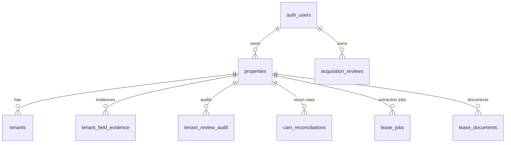

# MainStreet — Database & Persistence Reference

Every persisted object: where it lives, its fields, its relationships, its
lifecycle, and how it survives a round-trip. Supabase (Postgres + RLS +
Storage) is the source of truth; localStorage is an offline mirror only.

---

## 1. The storage model — hybrid blob + normalized

MainStreet deliberately uses **one JSONB blob per property**
(`properties.data`) as the primary store, with **normalized tables** added only
where a real need exists (cross-property queries, audit immutability, async
jobs). This keeps the schema stable while the product iterates fast, at the
cost of a strict discipline documented in §4.



All tables carry **RLS policies** scoping rows to `user_id` (hardened in
migrations 005/008). Tenant-role users get read-only access via the app layer
(`savePropertyData` returns early for tenants) plus passive isolation
(no `activePropId` in tenant mode).

## 2. Tables

### properties
The anchor table. `id (uuid)`, `user_id → auth.users`, `name`, `sqft`, and
**`data` (jsonb)** — the whitelisted property blob (§3). Everything else
references it with `on delete cascade`.

### tenants
Normalized tenant list (id, property_id, name, sqft, base fields) used for the
light portfolio load. **The blob's `data.tenants` is authoritative for rich
fields** (review state, overrides, capBaseAmount, confidence) — the table
exists so the property list renders without pulling blobs. Migration 009 makes
tenant resync atomic.

### tenant_field_evidence
Normalized evidence snapshots: `property_id`, `tenant_id`, `field_key`,
`value`, `confidence_status (verified|estimated|missing)`, `confidence_note`,
`source_file`, `source_page`, `extraction_id/version`, reviewer fields
(`reviewer_uid/email`, `reviewed_at`, `approved`, `manually_edited`,
`original_extracted_value`). When `ms_useNormalizedEvidence` is on, this table
is authoritative and `fieldEvidence` is omitted from the blob to avoid double
storage.

### tenant_review_audit
Append-only review audit trail: `action`, `label`, `severity
(info|success|warning|error)`, `old_value/new_value`,
`review_state_before/after`, reviewer identity, `client_ts`. Written by
`audit-service.js`; never updated or deleted.

### cam_reconciliations
One row **per tenant per reconciliation run**: `year`, `actual_cam`,
`expected_cam`, `variance`, `allocated_amount`, `pro_rata_percent`,
`total_expenses`, `reconciled_at`. Enables future cross-property/YoY queries;
the blob's `camReconciliation` snapshot remains what the UI renders from.

### lease_jobs
Async extraction job tracking: `status`, `stage`, `progress`, `file_name/size`,
`confidence_level (high|medium|low|failed)`, `confidence_score (0–100)`,
`extraction_route (text|pdf-direct|unknown)`, `error_message`,
`processing_started/completed_at`, `retry_count`, `debug_summary (jsonb)`.

### lease_documents
Uploaded document metadata linking properties/tenants to **Supabase Storage**
objects (the `fileUrl`s the Evidence Viewer fetches).

### acquisition_reviews
Owned by `user_id` directly (not property-scoped — reviews concern properties
you *don't own yet*): `name`, `status ('draft'…)`, `data (jsonb)` holding the
uploaded rent roll analysis, findings, and decision-report inputs. Migration
007 fixed the status check constraint.

### acquisition_documents
Every file an Acquisition Review was given (migration 023, **Pilot only**).
Owned through the review: `review_id` + `user_id` with a **composite foreign
key** to `acquisition_reviews (id, user_id)`, so a document can never claim an
owner its review does not have, and deleting a review takes its documents with
it. `storage_path` is a storage REFERENCE (`bucket/path`, SEC-1) and is NULL
when the original is not on file — too large, or the upload failed.
`parsing_status ∈ pending · success · partial · failed`; a failed extraction
keeps its row and its `error_message` rather than vanishing. `intake_kind`
records which upload control the file came through and is **not** a
classification — document type, families and versions are P1-3.
`unique (review_id, intake_id)` makes one UPLOAD one row, so the intake's two
writes (on arrival, then on extraction) update rather than duplicate. That key
was `(review_id, file_name)` until migration 024: re-uploading a file whose
name was already used replaced the row, and that source left the record even
though its object was still in the bucket. `intake_id` is minted once when a
file is taken in and reused by that upload's second write; the earlier row is
marked `superseded_by_document_id` and keeps everything it had (D-14).

**Classification, families and versions (migration 024, P1-3).**
`doc_type` is what the document is — the lease values match
`LeaseIntelligence.DOC_TYPE_TIER` so P1-4 reasons with the function that
already exists — and NULL or `unknown` is an ordinary state. `doc_type_status`
∈ `unclassified · proposed · confirmed · corrected` with `doc_type_source` ∈
`ai · human · intake_kind`: a model's reading is only ever `proposed`, and a
**trigger refuses any confirmed status whose `confirmed_by` is NULL**.
`doc_date` is the document's own effective date, which is what orders a family
(`created_at` is when it was uploaded). `classification_history` is an
append-only jsonb array of every proposal and correction with its actor and
time. `family_id` → `acquisition_document_families` is the leasehold, with
`family_status` ∈ `unfiled · proposed · confirmed`; a check plus the trigger
keep those two from disagreeing. `parent_document_id` + `relationship` is what
the document changes **in law**; `superseded_by_document_id` is a fact about a
file being uploaded twice and is deliberately not a `relationship` value.
**All three pointers are composite on `user_id`**, so nothing can point across
owners, and their `ON DELETE SET NULL` carries a column list — without one a
composite key nulls `user_id` too, and deleting a family would fail.
`acquisition_document_families` carries the same owner-only RLS, no anon
policy, and the same composite key to `acquisition_reviews`.

**What each document says (migration 025, P1-4 / P4-1 — applied to Pilot).** `abstracted_fields` is one jsonb object per document:
`{ schemaVersion, model, at, fields: { <field>: { value, quote, page,
confidence } } }` for the 27 fields `acquisition-terms.js` owns (the field
list is deliberately not encoded in the schema). **`value: null, quote: null`
means this document does not establish the term** — a different thing from a
document that denies it, which is a value with its quote; nothing in the
schema or the code that writes it turns the first into the second.
`abstraction_status ∈ pending · success · partial · failed · skipped`, where
`skipped` is the honest state for a document that is not a lease-family
document, and a check **refuses `success` or `partial` unless the object has a
`fields` key and `abstracted_at` is set** — a status may not claim a reading
it does not carry. The evidence column is not in the list select (it is read
per family by P4-2, like `extracted_text` is read per document); the three
bookkeeping columns are. The existing owner policy covers the new columns; no
new policy, table or function.

**What a person decided (migration 026, P1-4 / P4-3 — applied to Pilot).** `acquisition_term_decisions` is one row per human act on one lease
term: `confirm · correct · reject · reopen`, with `previous_value`,
`new_value`, an optional citation (`source_document_id`, `source_quote`,
`source_page`), `decided_by` NOT NULL and `decided_at`. The current decision is
the **latest row by `decided_at`**; everything before it is the audit trail.
**Append-only:** a trigger refuses any UPDATE that changes the action, the
values, the citation, the actor or the timestamps, and refuses a DELETE unless
the review it belongs to is already gone. The two nullable foreign keys may be
cleared to NULL and never repointed, which is what `on delete set null` does
when a family is deleted — a blanket refusal was the first design and it made
families and reviews undeletable, which executing the migration is what
revealed. A second trigger refuses a row whose `decided_by` is not its
`user_id`. Owner-only RLS, no anon policy, composite keys on `user_id` to
reviews, families and documents. **Nothing here ever writes
`abstracted_fields`:** the AI reading and the human decision are two records of
two different things, and `acquisition-terms.js resolveTerms` lays one over the
other at read time. 026 also widens
`acq_docs_relationship_status_check` to admit `needs_review` (D-17).

**Written from the browser, like `acquisition_reviews`.** There is no endpoint
in front of this table: RLS (`acq_docs_owner_all`, `user_id = auth.uid()`, no
anon policy) decides what a signed-in client may read and write, and the
composite foreign key refuses a document whose review is not that same user's.
`script.js` writes `user_id` from the session and never from a caller-supplied
field, so naming someone else's review produces a pair the parent table does
not have and the write fails with `23503`. There is **no delete** path in the
data layer and no control for one. `acquisition-documents.js` holds the write
allow-list and the list's column set. Isolated from `lease_documents` on
purpose: that table is property-scoped, and a review has no property until it
is converted. See `docs/ACQUISITION_REVIEW.md` §4b.

**`data` shape and writes (Acquisition Review P1-1).** `acquisition-workspace.js`
owns the layout (`schemaVersion: 2`, `stage`, `activity[]`, `documents[]`,
`families[]`, `assumptions[]` alongside the existing `tenants`, `invoices`,
`totalSqFt`, `analysis`, `conversionRecord`, `conversionHistory`). Rows are
upgraded in memory on load and reach the database in the new shape with
their next real change — no migration, no backfill. A save is a **conditional
UPDATE** on `id`, `user_id` and the `updated_at` last read (the trigger
stamps a new one on every update); zero rows matched is reported to the user
as a conflict and the stored row is reloaded, never overwritten. Details in
`docs/ACQUISITION_REVIEW.md` §4.

## 3. The property blob — `properties.data`

`saveProperty` writes an **explicit whitelist** (script.js `saveProperty`).
Anything not on this list does not survive a save:

| Key | Object | Notes |
|---|---|---|
| `tenants[]` | Tenant records incl. review state, `fieldEvidence` snapshots (unless normalized reads are on), caps, overrides | Rich source of truth |
| `invoices[]` | Uploaded/imported invoices (categorized, dedup-flagged) | Blob URLs stripped first |
| `disputes[]` | Dispute records + resolution + audit fingerprint | |
| `camYear` | Active reconciliation year | |
| `results` | Legacy recon shape (kept for back-compat) | Guarded: only overwritten when a run happened this session |
| `camReconciliation` | Recon snapshot: `{propId, results[], total, invoices, camRuns[]}` | `invoicesFull` stripped before save (in-session only); `propId` verified on load |
| `settlement` | RLUSD settlement record: `{status, txHash, amount, from, to, timestamp, explorerLink, fingerprint}` | **Must** be on the whitelist — omitting it was the "stuck pending" bug |
| `aiDrafts[]` | Saved Drafting Studio documents | |
| `escrowReserves[]` | Reserve definitions + `evidence{field}` quotes | Blob pattern, per Phase 21 |
| `drawRequests[]` | Draw lifecycle records (`draft→submitted→…→funded`) | |
| `activityLog[]` / `timeline[]` | Activity + event history | |
| `_demoVersion` / `_demoV` | Demo re-seed markers | Preserved so saves don't force re-seeding |

**Workspace Context, AI answer history (`_aiwHistory`), and Evidence Viewer
state are deliberately NOT persisted** — session-scoped by design.

## 4. Lifecycle — the four-hop persistence invariant

Every blob field must be carried through **all four hops** or it silently
disappears:

```
1. saveProperty      — field must be on the data{} WHITELIST
2. loadPropertyData  — field must be in the blob→property FIELD MAP
3. merge             — DB-authoritative fields must win over the LS mirror
                       (results, camReconciliation, settlement, aiDrafts, disputes)
4. selectProperty    — field must be APPLIED onto the in-memory property
```

A field present in three hops but missing from one produces the worst kind of
bug: it works all session, then vanishes on refresh (or worse, on the *next
unrelated save*). The settlement record historically failed hops 1, 2, **and**
4 simultaneously. When adding a persisted field, update all four hops and add
a round-trip test (see `TESTING_GUIDE.md`).

Additional pipeline behavior:

- **Generation guard:** each save claims `++_saveGeneration`; a stale save
  completing after a newer one is discarded.
- **Debounce:** rapid edits collapse into one DB write 800 ms after the last.
- **Snapshot:** `_captureSnapshot` before every save enables
  `recoverLastSnapshot()`.
- **localStorage mirror:** written first (offline resilience), merged on load
  with DB authoritative for the critical fields above.
- **Blob stripping:** `_stripBlobs` removes file blobs/object URLs;
  `camReconciliation.invoicesFull` never persists.
- **Tenant-write guards:** tenant-role saves return early; empty
  `invoiceData`/`lastResults` never overwrite persisted arrays (prevents a
  tenant-portal dispute save from wiping invoices/results).

## 5. Demo data

`ensureDemoProperty` seeds one demo property **per user** (stable per-user id,
`_demoV` version marker). Re-seeding is idempotent and version-gated: it skips
when the row already has recon results, the current `_demoV`, and a settlement
txHash. Multiple demo rows across the `properties` table are expected — one
per user, not duplicates. `ensureDemoAcqReview` seeds the Harborview
acquisition review the same way.

## 6. Migration notes (001–009)

| # | What | Why |
|---|---|---|
| 001 | `lease_jobs` | Async extraction with progress/status |
| 002 | `tenant_field_evidence`, `tenant_review_audit` | Normalized evidence + immutable audit |
| 003 | `cam_reconciliations` | Per-tenant recon rows for future querying |
| 004 | Lease-intelligence columns (multi-doc, supersedence) | Amendment handling |
| 005 | RLS hardening | Strict per-user row isolation |
| 006 | `acquisition_reviews` | Acquisition module persistence |
| 007 | Fix acq review status constraint | Constraint bug |
| 008 (+008b) | Database hardening + verification queries | Indexes, constraints, checks |
| 009 | Atomic tenant resync | Prevent partial tenant-table states |
| 023 | `acquisition_documents` (+ a unique `(id, user_id)` on `acquisition_reviews` for the composite FK) | Acquisition Review keeps every source it is given (P1-2). Pilot only; rollback in `023_..._rollback.sql`; executed end-to-end by `tools/verify-migration-023.js` |
| 024 | classification / family / version columns on `acquisition_documents`, `acquisition_document_families`, the `intake_id` identity swap and the coherence trigger | What each source IS, which leasehold it belongs to, what it changed, and what replaced it (P1-3). Answers D-14 so a re-upload keeps both sources. Pilot only; rollback in `024_..._rollback.sql`, which **refuses** to restore 023's unique key while that would mean destroying a preserved source; executed end-to-end by `tools/verify-migration-024.js` |
| 025 | `abstracted_fields`, `abstraction_status`, `abstraction_model`, `abstracted_at` on `acquisition_documents`; three checks and one partial index | What each document SAYS about each of 27 lease terms, with the clause behind it (P1-4, P4-1). Pilot only; rollback in `025_..._rollback.sql`; executed end-to-end by `tools/verify-migration-025.js`. **Applied to Pilot 2026-09-21** (`20260921201418_025_acquisition_abstraction`) with the three existing documents verified byte-identical and `pending`; first real abstraction written 2026-09-21 20:30:55Z (27 fields, 10 evidenced, 17 missing) and verified in place — see `docs/ACQUISITION_REVIEW.md` §4f. |

| 026 | `acquisition_term_decisions` (append-only human decisions on lease terms) + the D-17 widening of `acq_docs_relationship_status_check` to admit `needs_review` | What a PERSON decided about a term, so a term can read `verified` at all (P1-4, P4-3). Append-only by trigger; the AI evidence in `abstracted_fields` is never modified from here. Pilot only; rollback in `026_..._rollback.sql`, which **refuses** to narrow D-17 while a document sits in `needs_review`; executed end-to-end by `tools/verify-migration-026.js`. **Applied to Pilot 2026-09-22** with the three existing documents verified byte-identical and the decisions table empty. |

Migrations are plain SQL applied via the Supabase SQL editor (no migration
runner in-repo). New migrations: next number, idempotent
(`create table if not exists`, guarded `alter`), and always paired with RLS
policies for new tables.

## 7. When to normalize vs blob

Follow the existing precedent:

- **Blob** (default): feature-local state read/written whole with the property
  — reserves, drafts, settlement, disputes.
- **Normalized table**: you need cross-property queries (cam_reconciliations),
  immutability (tenant_review_audit), async coordination (lease_jobs), or
  authoritative per-field metadata (tenant_field_evidence).

Moving a field from blob to table later is a straightforward overlay (the
loadPropertyData pattern already merges table overlays onto the blob) — so
default to blob until a query need is real.
