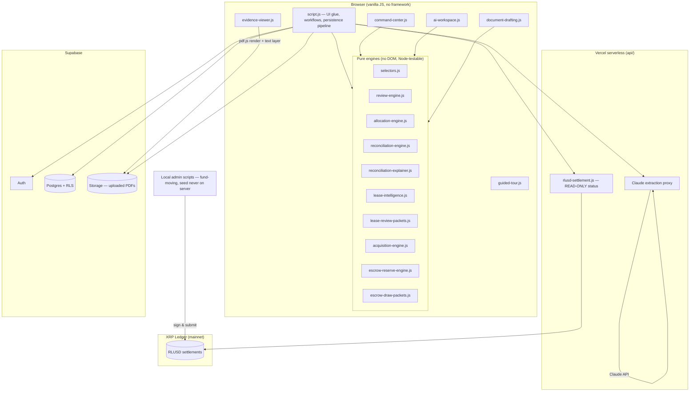
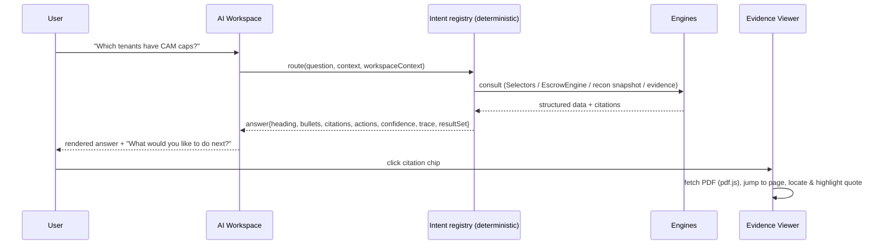
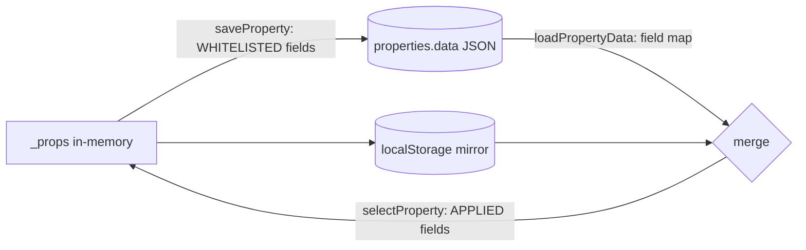
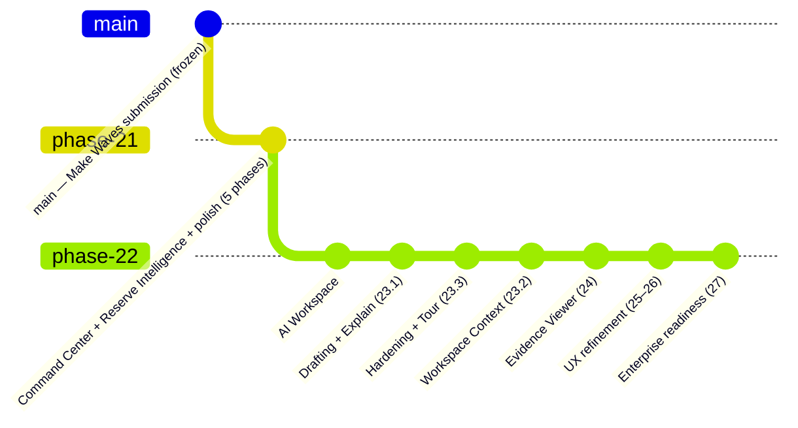

# MainStreet — Technical Architecture

> The definitive system map. Written so a new engineer, an investor's technical
> advisor, or a future AI session can understand MainStreet without reverse-
> engineering the codebase. Companion documents: `SYSTEM_DATA_FLOW.md`,
> `MODULE_REFERENCE.md`, `AI_ENGINE_REFERENCE.md`, `XRPL_ARCHITECTURE.md`,
> `DATABASE_REFERENCE.md`.

---

## 1. What MainStreet is

An AI operating system for commercial real estate: CAM (common area maintenance)
reconciliation, AI lease/invoice extraction with verbatim citations, capital
reserve & escrow intelligence, acquisition analysis, evidence-grounded document
drafting, a conversational AI Workspace — and settlement of reconciled amounts
in **RLUSD on the XRP Ledger** as a public, verifiable proof-of-settlement layer.

**Design creed (enforced throughout):**
1. **Deterministic over generative** — the AI surfaces (Command Center,
   Workspace, Drafting, Evidence Viewer) are deterministic orchestration over
   engine-computed data. The only generative AI is server-proxied Claude used
   for *document extraction*, and its output carries verbatim quotes + page
   citations + confidence scores.
2. **Evidence-first** — every figure traces to an invoice, a lease clause, or an
   on-ledger transaction. Citations are load-bearing, not decoration.
3. **Honest by construction** — unknowns are stated as unknown; nothing renders
   a fabricated state ("pending" settlement UIs never show fake hashes; the
   Workspace says "I won't guess").
4. **Orchestration over reinvention** — new capabilities consume existing
   engines; business logic is never duplicated.

## 2. System overview

## 3. Application structure

| Layer | Files | Notes |
|---|---|---|
| UI shell & glue | `index.html`, `script.js` (~21k lines) | All markup + view routing + persistence pipeline + upload workflows. The monolith; everything new since Phase 21 was deliberately built *outside* it as pure modules. |
| AI surfaces | `command-center.js`, `ai-workspace.js`, `document-drafting.js`, `evidence-viewer.js`, `guided-tour.js` | Window-IIFE modules, dependency-injected, Node-testable. |
| Engines | `selectors.js`, `review-engine.js`, `allocation-engine.js`, `reconciliation-engine.js`, `reconciliation-explainer.js`, `lease-intelligence.js`, `acquisition-engine.js`, `escrow-reserve-engine.js` | Pure functions; no DOM/network/global state. |
| Report formatters | `lease-review-packets.js`, `escrow-draw-packets.js` | Engine data → printable HTML (openReport + window.print). |
| XRPL | `rlusd-integration.js` (production), `xrpl-integration.js` (testnet anchor prototype), `escrow-reconciliation.js` (testnet CAM-escrow experiment, unrelated to reserves) | See `XRPL_ARCHITECTURE.md`. |
| Server | `api/` (Claude proxy, read-only settlement status), `scripts/` (local fund-moving admin), `migrations/` (001–009 SQL) | |
| Auth/roles | `auth-service.js`, `access-control.js` | Supabase auth; landlord vs tenant roles. |

## 4. User roles

- **Landlord / property manager** — full workflow: properties, uploads,
  reconciliation, reserves, reports, Command Center, Workspace, drafting.
- **Tenant** — read-only portal: their statement, dispute submission, settlement
  verification. Tenant role passively blocks all saves (`activePropId` is never
  set) plus explicit guards on AI surfaces.
- **Review-link viewer** — expiring read-only executive review links.

## 5. AI architecture (summary — full detail in AI_ENGINE_REFERENCE.md)

Key properties: **no LLM in the answer path**; every answer carries a
**reasoning trace** (engine, sources, citations used, result set reused/produced);
follow-ups reuse the previous **deterministic result set** (Workspace Context,
not chat memory); every answer ends with action buttons (product identity rule,
enforced in one renderer).

## 6. Command Center architecture

`command-center.js` builds a full view model per render from live state:
per-property `buildPropMeta` + `derivePropertyReadiness` → ranked
recommendations (8 property sources + reserves + acquisitions), executive
summary (deterministic narrative — every sentence backed by a card),
opportunity totals (reusing `computeRecoveredRevenue`), health scores,
real-event timeline, settlement rows. Scale guards: top-6 priorities +
collapsed ≤50; health grid caps at the 24 worst-health properties.

## 7. Document Intelligence

- `extractPdfText` (script.js) — pdf.js text layer, `--- Page N ---` markers,
  50-page cap **with in-text truncation marker**, per-page corruption tolerance.
- Claude extraction (server-proxied) returns fields + `evidence{field: {quote,
  page}}`; scanned PDFs go through the vision path (confidence-penalized).
- `lease-intelligence.js` — multi-document supersedence: amendments override
  originals per-field with a governing-document trail.
- Evidence persists as `fieldEvidence[field].snapshots[]` (tenants) and
  `reserve.evidence{field}` — the single citation substrate for the Workspace,
  Drafting, and the Evidence Viewer.

## 8. Evidence Viewer

Three tiers, degrading honestly: (1) evidence panel — always; (2) PDF page
render when a `fileUrl` exists; (3) quote located in the text layer and
highlighted — if unlocatable, jump to the page and say so. Search mode scans the
loaded document's text layer. One citation shape everywhere:
`{source, detail, page, quote, fileUrl}`.

## 9. Reserve Intelligence

`escrow-reserve-engine.js`: canonical reserve types; draw-request lifecycle
state machine (draft→submitted→under_review→approved→funded, legal transitions
+ immutable history); balance math (current/committed/available);
requirements-driven validation; **Escrow Readiness Score** (weighted % over the
same validation gate); reserve health + runway projection (optional
plannedProjects/monthlyContribution — `{unknown:true}` when data absent);
assistant-voice narrative (`buildReserveNarrative`); lender package + email
builders. UI: two workflows — "Reserve & Loan Documents" and "Reserve Requests".

## 10. CAM Reconciliation

`allocation-engine.js` (pro-rata + caps + exclusions, unit-tested) feeds the
reconciliation workflow in script.js; snapshots persist as
`property.camReconciliation` (results, camRuns history, invoicesFull stripped
on save). `reconciliation-explainer.js` produces tenant-facing narratives.
`allocation-integrity.js` cross-checks. Disputes carry SHA-256 audit
fingerprints via `audit-service.js`.

## 11. Acquisition Engine

`acquisition-engine.js`: revenue-at-risk tiers by lease expiry, recovery-rate
analysis (cap leakage, underbilling), renewal pipeline, WALT, portfolio
intelligence and ranked portfolio actions. Consumed by its own review UI, the
Command Center, and the Workspace.

## 12. XRPL integration (summary — full detail in XRPL_ARCHITECTURE.md)

RLUSD (issuer `rMxCKbEDwqr76QuheSUMdEGf4B9xJ8m5De`) on mainnet. One production
settlement wallet signs via **local admin scripts only** (hidden-prompt seeds);
the public API is read-only status. Every settlement Payment and TrustSet
carries Make Waves Source Tag `2606290001` and a SHA-256 memo fingerprint of
the settlement record. First live settlement:
`D5F11B5EF7BD9C9BC8062FDA2F6B94BCA1F95DC3417C372548BB5F6082B4D12A`.

## 13. Supabase architecture

- **Auth** — email/password; user id scopes all rows (RLS).
- **Postgres** — `properties` (JSON `data` blob is the canonical property
  state), `tenants` (normalized subset), `cam_reconciliations`,
  `tenant_field_evidence`, `tenant_review_audit`, lease-job and acquisition
  tables (migrations 001–009).
- **Storage** — uploaded PDFs (leases, reserve docs, draw attachments); public
  fetchable URLs consumed by reprocess + Evidence Viewer.

## 14. Security model

- Anthropic key and any signing material live **server-side or local-only**;
  the browser holds only the Supabase anon key (RLS-enforced).
- The settlement wallet **seed never touches the server**: fund-moving actions
  are local scripts with hidden input; `api/rlusd-settlement.js` refuses
  `settle`/`setup-trust-line` by design.
- Per-user demo IDs prevent cross-user collisions; tenant role is read-only by
  both passive design and explicit guards.
- Rate limiting on API routes; server-side token verification before privileged
  calls.

## 15. Persistence model (the part that bites — read DATABASE_REFERENCE.md)

**Critical invariant:** a persisted field must appear in **four** places —
`saveProperty`'s data whitelist, `loadPropertyData`'s field map, the merge
object, and `selectProperty`'s apply step. Omitting any hop silently drops the
field (this exact bug shipped once, with `settlement` — see TESTING_GUIDE.md).

## 16. Testing strategy (summary — full detail in TESTING_GUIDE.md)

`node test-regression.js` runs every offline suite (allocation, disputes,
extraction fixtures, escrow/reserve engine 182 assertions, persistence, RLUSD
builders 8). Phase 21–27 module harnesses (Command Center 65, Workspace 96,
Drafting 23, Evidence 15, Tour 12) run the pure modules in Node via `vm` with
the **real** engines — see TESTING_GUIDE.md for their current location caveat.
Benchmarked at 500 properties: all compute paths 4–53 ms.

## 17. Branch topology

Merge order after the competition: `phase-21` → then `phase-22` (which contains
it). `main` stays byte-identical to the judged submission until then.
