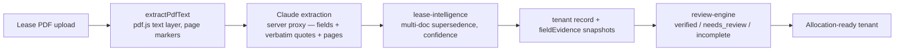
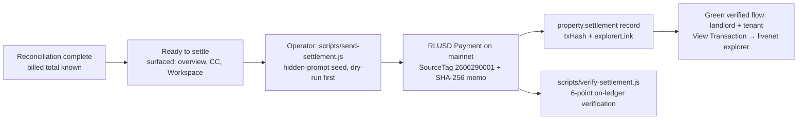

# MainStreet — System Data Flow

How information moves through the platform, workflow by workflow. Every arrow is
real code; module names match `MODULE_REFERENCE.md`.

---

## 1. Lease intake → billing-ready tenant



Scanned/image PDFs divert at B → Claude vision path (`callClaudeWithPdfDirect`),
confidence-penalized. Corrupt pages and >50-page truncation are marked **in the
text** so nothing is silently missing.

## 2. CAM reconciliation

```
Invoices (upload / Yardi CSV)
  → categorized + duplicate-detected
  → allocation-engine (pro-rata × caps × exclusions per lease)
  → camReconciliation snapshot {results, total, camRuns history}
  → persisted (properties.data) + cam_reconciliations rows
  → surfaces: Reconciliation Summary · Master Report · Tenant Statements
             · Selectors (meta/risk) · Command Center · Workspace answers
```

## 3. Dispute lifecycle

```
Tenant portal: dispute a charge
  → dispute record {tenant, vendor, amount, reason} on the property
  → landlord review (accept / request docs / reject)
  → resolution + SHA-256 audit fingerprint (audit-service)
  → feeds: recovered-revenue (accepted), Command Center dispute cards,
           Workspace dispute answers, Dispute Response drafting
```

## 4. Reserve reimbursement (mortgage → money back)

```mermaid
flowchart LR
    A[Mortgage/escrow PDF] --> B[Claude extraction<br/>reserve terms + quotes + pages]
    B --> C[normalizeReserve + mergeReserveExtractions]
    C --> D[escrowReserves on property]
    D --> E[Draw request: invoices, bids,<br/>photos, lien waivers, certs]
    E --> F[validateDrawRequest → Escrow Readiness %]
    F --> G[Lender package + email<br/>escrow-draw-packets / Drafting Studio]
    G --> H[Status lifecycle:<br/>draft→submitted→…→funded]
    H --> I[computeReserveBalance:<br/>committed vs available]
```



## 5. AI answer (Workspace / Explain Mode)

```
Question (typed, suggestion chip, or Explain This)
  → follow-up pre-pass (reuses Workspace Context result set if referenced)
  → deterministic intent registry (~25 intents)
  → engine consultation (Selectors / recon snapshot / EscrowEngine /
    AcquisitionEngine / evidence scan / settlement records)
  → answer {bullets, citations, confidence, actions, trace, resultSet}
  → renderer: identity rule ("What would you like to do next?") + live chips
  → Workspace Context updated (result set carried for follow-ups)
```

## 6. Citation → original document (Evidence Viewer)

```
Citation chip click
  → answer's embedded citation payload (data-evd)
  → Tier 1: evidence panel (quote, page, confidence, reason)
  → Tier 2: fetch fileUrl → pdf.js renders cited page
  → Tier 3: locateQuoteInItems on the text layer → highlight boxes
            (unlocatable → honest page-jump banner)
  → optional: find-in-document → matches become navigable citations
```

## 7. Document drafting

```
"Generate a recovery letter" (Workspace, or Command Center action)
  → DocumentDrafting.build(type, context)
      consumes: recon results, ReconciliationExplainer, lease fieldEvidence,
      EscrowReadiness, dispute records, acquisition analysis
  → editable DRAFT (contenteditable) + citations + confidence + [human-decision placeholders]
  → Save (property.aiDrafts via the 4-hop persistence pipeline)
  → Export PDF (print window, DRAFT watermark, honors edits)
  → user sends manually — never automatic
```

## 8. Settlement → XRPL



## 9. Persistence round-trip (every property mutation)

```
in-memory _props mutation
  → saveProperty: _stripBlobs → WHITELISTED data{} → Supabase upsert
                → localStorage mirror (offline resilience)
refresh/open
  → loadProperties (list: id/name/sqft + tenants table)
  → selectProperty → loadPropertyData (blob field map + LS merge,
    DB authoritative for results/camRec/settlement/aiDrafts/disputes)
  → applied onto the in-memory property (the 4th hop)
```

## 10. First-run / demo

```
Signup → landlord role → loadProperties
  → ensureDemoProperty (per-user stable ID, idempotent versioned re-seed)
  → ensureDemoAcqReview (Harborview)
  → Command Center landing (empty portfolio → first-run hero)
  → Guided Tour (adapts to data actually on file)
```
