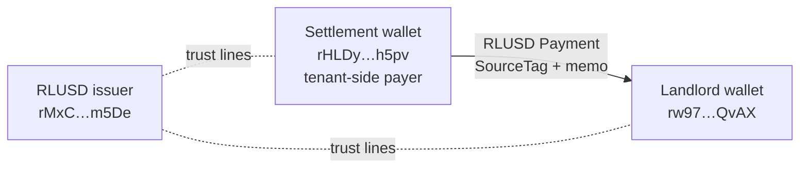
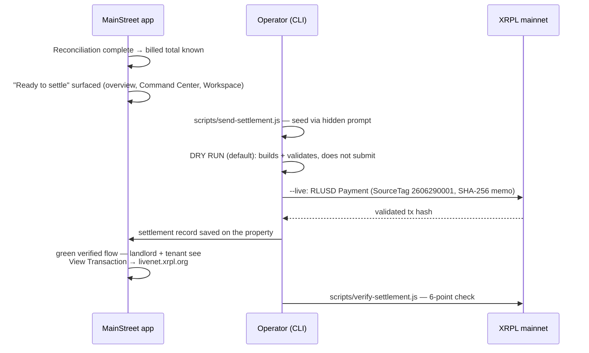
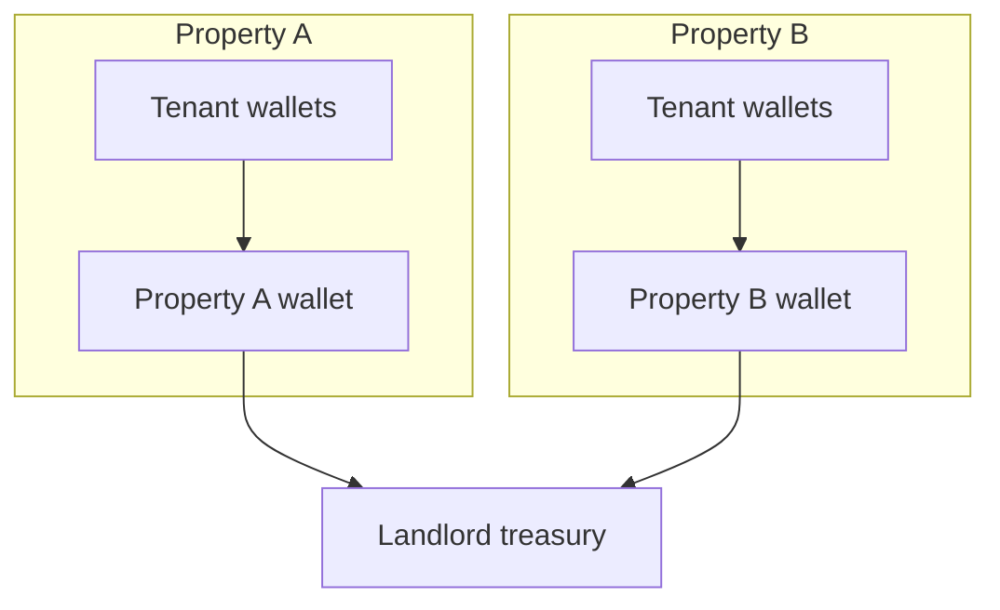

# MainStreet — XRPL Settlement Architecture

How MainStreet settles CAM reconciliations in RLUSD on the XRP Ledger mainnet:
wallet architecture, transaction anatomy, verification, security decisions, and
the honest list of what this architecture does and does not yet do.

---

## 1. Why XRPL + RLUSD

- **RLUSD** is Ripple's regulated USD stablecoin — dollar-denominated
  settlement (what CAM reconciliation actually owes) with on-ledger finality.
- **XRPL mainnet** gives 3–5 second finality, sub-cent fees, and a public,
  permanent audit trail any party can independently verify.
- The ledger is the **settlement + audit layer**; all business logic
  (allocation, caps, disputes) stays in MainStreet. The chain records the
  outcome, it does not compute it.

## 2. Network constants

| Constant | Value |
|---|---|
| Network | XRPL **mainnet** (wss://xrplcluster.com and fallbacks) |
| RLUSD issuer | `rMxCKbEDwqr76QuheSUMdEGf4B9xJ8m5De` |
| RLUSD currency code | `524C555344000000000000000000000000000000` (hex "RLUSD") |
| Settlement wallet | `rHLDysh6p6TcJM7QXU15YRLG4mERF5h5pv` |
| Landlord wallet | `rw97rJThBJtoVRqR4DsoK5kW2taftzQvAX` |
| Source Tag | `2606290001` (Make Waves; overridable via `XRPL_SOURCE_TAG`) |
| First live settlement | tx `D5F11B5EF7BD9C9BC8062FDA2F6B94BCA1F95DC3417C372548BB5F6082B4D12A` |

## 3. Wallet architecture (current)



- **Two operator-controlled wallets** model the tenant→landlord settlement leg.
- Both hold RLUSD **trust lines** to the issuer (a TrustSet is required before
  an account can hold any issued currency on XRPL).
- Wallets are funded with XRP for reserves + fees; RLUSD moves the settlement
  value.
- A previously used wallet (`rG2ZaUs5SodnNNE23ktTzNbRt55PQZNPrn`) was
  **compromised and abandoned**; the current wallets are its rotation
  replacements (see §7).

## 4. Settlement lifecycle



The settlement record persisted on the property:

```js
property.settlement = {
  status: 'settled', txHash, amount, currency: 'RLUSD',
  from, to, timestamp, explorerLink, fingerprint /* SHA-256 */
}
```

It rides the standard 4-hop persistence pipeline (saveProperty whitelist →
loadPropertyData field map → merge → selectProperty apply). All four hops must
carry the field — a missed hop was the root cause of the historical
"stuck pending" bug (see `TESTING_GUIDE.md`).

## 5. Transaction anatomy

Every settlement Payment carries:

- **Amount:** issued-currency object `{currency: RLUSD hex, issuer, value}`.
- **SourceTag `2606290001`** — identifies MainStreet/Make Waves traffic
  on-ledger; attached to Payments **and** TrustSets.
- **Memo: SHA-256 fingerprint** of the reconciliation payload — binds the
  on-ledger transaction to the exact off-ledger reconciliation it settles.
  Anyone holding the reconciliation data can recompute the hash and confirm
  the match; nobody can forge a different reconciliation for the same tx.
- Standard XRPL fields (Fee, Sequence, LastLedgerSequence) handled by xrpl.js
  autofill.

## 6. Verification — trust nothing, check the ledger

`scripts/verify-settlement.js` performs an independent **6-point on-ledger
verification** against public XRPL endpoints (multi-endpoint fallback; reads
`result.tx_json`; auto-classifies args so a wallet address vs tx hash "just
works"):

1. Transaction exists and is **validated** (`tesSUCCESS`).
2. Correct **sender** (settlement wallet).
3. Correct **destination** (landlord wallet).
4. Correct **currency + issuer** (RLUSD from the official issuer).
5. Correct **delivered amount**.
6. **Memo fingerprint** matches the reconciliation SHA-256.

In-app, `api/rlusd-settlement.js` exposes a **read-only `status`** action and
every settlement surface links to the public explorer
(`livenet.xrpl.org/transactions/<hash>`) — users verify on infrastructure
MainStreet doesn't control.

## 7. Security decisions

| Decision | Rationale |
|---|---|
| **Seeds never touch the server, the repo, or the browser.** | Signing happens only in operator-run CLI scripts; seeds are entered via hidden prompts (readline, no echo), never as CLI args (shell history) and never in env files. |
| **The web app cannot move money.** | `api/rlusd-settlement.js` is read-only. There is no signing key in any deployed environment; a full server compromise cannot spend funds. |
| **Dry-run by default.** | `send-settlement.js` builds and validates without submitting unless `--live` is explicit. |
| **Wallet rotation on compromise.** | When a seed was exposed, the wallet (`rG2Za…NPrn`) was drained-to-safe, abandoned, and replaced; new seeds generated locally (`generate-settlement-wallet.js` writes to a private file, never stdout-logs the seed). |
| **Sanity scripts.** | `wallet-address.js` verifies a seed↔address match before anything is sent; `setup-trust-line.js` and `send-xrp.js` isolate one-time setup steps. |
| **Public verifiability over private assurance.** | Explorer links + independent verify script mean no party has to trust MainStreet's database about whether money moved. |

## 8. Future: per-property wallet architecture

The current two-wallet setup proves the settlement rail. Production
multi-tenancy needs:



- **One wallet per property** (destination tags per tenant, or one wallet per
  tenant for stronger isolation).
- **Custody:** operator CLI signing doesn't scale — the path is a custody
  provider or platform wallet service (e.g. Xaman/Xumm user-held keys, or a
  managed custodian), so MainStreet still never holds seeds.
- **Automated reconciliation-to-payment matching** via SourceTag/DestinationTag
  + memo fingerprints (the anatomy in §5 was designed for this).
- **Tenant-initiated payment**: tenants pay from their own wallets; MainStreet
  detects + verifies incoming settlement rather than sending it.

## 9. Honest limitations

- Settlement is **operator-executed CLI**, not in-app; a landlord cannot click
  "settle" (deliberate — see §7 — but a real product gap).
- **One settlement wallet** serves all properties; per-property fund isolation
  doesn't exist yet.
- Settlement is **one-directional** (tenant-side wallet → landlord); refunds
  or tenant credits have no on-ledger flow.
- **Partial payments / payment plans** are not modeled — one reconciliation,
  one payment.
- RLUSD trust-line setup is a manual prerequisite per wallet.
- No fiat on/off-ramp integration; RLUSD acquisition is out of band.
- The 300-active-account Make Waves prize threshold is architecturally out of
  reach for a two-wallet design — acknowledged, not gamed.
